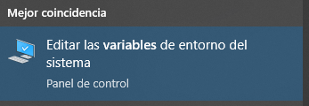
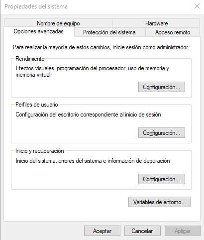
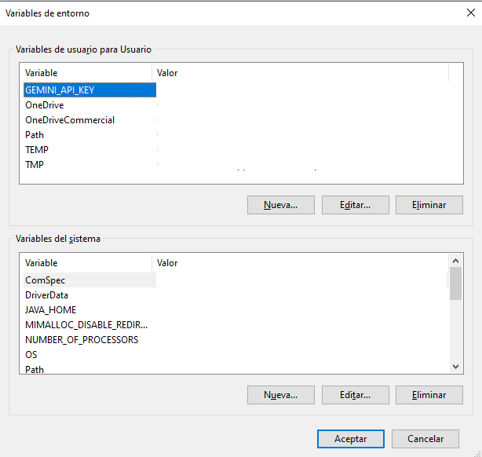

# Automatización de las Delcaraciones de Impacto Ambiental (DIA) en España

## Guía de instalación 
1. Instalar dependencias 
`pip install -r docm_cca/dependiex.txt`
2. Instalar driver de Mozzilla. 
Se encuentra en `https://github.com/mozilla/geckodriver/releases/tag/v0.35.0`. 
Seleccionar la versión para windows con arquitectura de 64 bits: geckdriver-vX.XX.X-win64.zip
3. Obtención de una clave de API para Gemini Google
Se puede encontrar en el siguiente enlace. https://ai.google.dev/gemini-api/docs/api-key?hl=es-419
4. Añadir clave API como variable de entorno 
    - Entrar en **Editar las variables de entorno del sistema**

     

    - Hacer click en **Variables de entorno ...**

     

    - Añadir nueva variable de entorno bajo Variables de usuario para Usuario con variable **GEMINI_API_KEY** y valor el que la clave API que nos acabamos de crear
    
     

